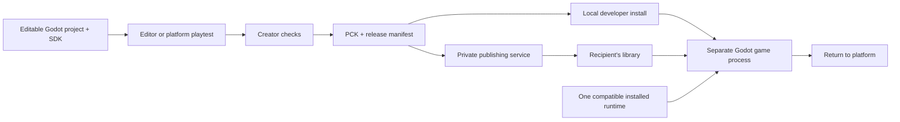

# Giga Couch Game Development Kit

Status: product definition and delivery plan, September 16, 2026. **The repository contains a working prototype, not a released GDK.** “Available” below means implemented in this checkout; “planned” means part of the kit we still need to deliver.

This document turns the promise in [PRODUCT.md](PRODUCT.md) into a creator-facing product. [TECH_STACK.md](TECH_STACK.md) defines the platform architecture; [IMPLEMENTATION_PLAN.md](IMPLEMENTATION_PLAN.md) tracks implementation.

## 1. What is the GDK?

**The Giga Couch GDK is everything a developer—or their AI assistant—needs to turn an ordinary Godot project into a controller-first game that runs on the Giga Couch platform.**

Godot supplies the engine. The GDK supplies the common living-room experience and the path from an editable project to an installed, privately shared game.

The distinction between our products is:

| Product | Who uses it | What it does |
| --- | --- | --- |
| **GDK** | Game creators | Starter projects, SDK, editor tools, CLI, examples, documentation and compatibility checks |
| **SDK** | Game code, inside Godot | Reusable input, player, menu, lifecycle, save and feedback services |
| **Platform app** | Players and creators testing games | Library, installation, shared runtime management, game launch and return |
| **Platform services** | The app and publishing tools | Accounts, private sharing, release storage and authorization |

A creator should be able to start a game, join with two controllers, change the gameplay, save progress and launch it from the platform without writing controller assignment, a pause menu, an installer or a backend.

The creator owns a normal Godot project. They can edit it manually, use Git, bring their own AI tools, replace our UI, and keep their source independently of the platform. Standard Godot export remains a separate option, subject to the project's dependencies and asset licenses.

## 2. What do developers get?

The first released kit should contain the following versioned deliverables.

| Deliverable | What the creator receives | Current position |
| --- | --- | --- |
| Godot addon | `addons/couchgames/`, the `Platform` autoload, documented types/signals and runtime policy | Runtime checks, player input and experimental motion exist; complete service API planned |
| Reusable couch UI | Join/ready lobby, selection cards, input prompts, pause/settings, disconnect handling and confirmations | Implemented in individual examples; extraction into reusable scenes planned |
| Two small starters | Independent 2D and 3D projects with a working create/play/save/exit loop | A standalone Little World-based 3D starter is bundled in the setup preview; a clean 2D starter and full create/play/save/exit contract remain planned |
| Godot editor tools | Setup/status panel, project settings, action definitions, validation and platform playtest entry | Runtime status panel exists; remaining tools planned |
| Creator CLI | Project creation, diagnosis, playtest, checks, packing, local install and private publishing | `doctor`, artifact `validate`, unsigned `install` and `library` exist; setup preview bundles a prebuilt macOS CLI |
| Local platform playtest | Run a developer project through the same lifecycle used by installed games | Source catalog and Python supervisor exist; generic project registration and production host planned |
| Reference examples | Small recipes for motion, split-screen, shared cameras, selection and feedback | Playable examples exist; focused recipes planned |
| Creator documentation | First-game guide, API reference, recipes, errors, migrations and troubleshooting | Setup preview includes an offline first-game guide; complete API/recipe documentation remains planned |
| AI integration pack | `AGENTS.md`, machine-readable API/manifest schemas, runnable examples and structured diagnostics | Manifest schema and CLI JSON exist; creator-specific integration pack planned |
| Release checks | Project checks, runtime tests, controller/TV checklist and a report describing what was tested | Internal synthetic/engine tests exist; reusable creator test harness planned |

The core kit must stay small. Large demonstration games, Blender sources and optional art packs should be separate downloads. Starting a new game should not copy Gauntlet, Sunbreak or their entire asset collections.

### What a starter contains

Proposed generated layout; `couch.game.json`, `couch.lock` and the starter structure are **not implemented yet**:

```text
my-game/
  project.godot
  couch.game.json             # Editable game identity, entry scene and capabilities
  couch.lock                  # Exact SDK/tool/template compatibility information
  addons/couchgames/          # Pinned SDK source
  scenes/main.tscn
  scenes/player.tscn
  scripts/game.gd             # Spawn players and implement game rules
  scripts/player.gd           # Movement and game actions
  assets/                    # Small, redistribution-cleared placeholder art
  tests/                     # Starter behavior and platform integration checks
  export_presets.cfg         # Tested preset supplied for the chosen runtime target
  README.md
  AGENTS.md
  LICENSES/                  # Kit and included asset notices
```

The starter opens to a working lobby, supports controller-only play, demonstrates one save slot, and returns to the platform. It also runs directly from the Godot editor using local development services. Creators can replace the lobby or visuals while retaining the underlying services.

## 3. The division of work

| The game developer owns | The SDK owns | The desktop platform owns |
| --- | --- | --- |
| Rules, levels, characters, combat, physics and scoring | Route each controller's actions to its player | Detect/manage a compatible installed runtime |
| Camera behavior and number/layout of views | Join/leave events and reusable roster/ready logic | Start and supervise separate game processes |
| Available character classes, vehicles and customization choices | Controller focus, prompts and reusable selection UI | Install/update content and maintain the SQLite library |
| What progress to save and how old game data migrates | Save API, results and lifecycle coordination | Enforce per-game/profile storage and retain saves |
| When gameplay pauses and what a disconnected character should do | Consistent lifecycle events and input clearing | Recover the library after exit, failure or crash |
| Art, music, sound design and game-specific effects | Capability-aware feedback routing and settings | OS integration, account credentials and authorized downloads |

The GDK does not automatically make a game support sixteen players, split-screen or online play. It removes common infrastructure work; the creator still designs and tests their game's rules and performance.

## 4. The SDK contract

The following is the intended release contract. Public names beyond the existing API in section 7 remain provisional until both starters and migrated examples exercise them.

### Players and actions

- Support **1–16 local player slots**. A game declares its own minimum and maximum.
- Use session player IDs instead of hardware device IDs. Persistent profiles are a separate identity.
- Give each controller one owner; prevent another player's buttons from changing their selection or character.
- Define semantic actions such as `move`, `look`, `jump`, `primary_action`, `secondary_action`, `pause` and menu navigation. Games can add actions and bind defaults.
- Provide held, pressed and released states, analog values, dead zones, remapping and prompts. Specify input sampling/edge-consumption behavior so multiple components do not accidentally lose events.
- Separate menu input from gameplay input. Joining, confirming or resuming must not immediately trigger an attack or jump.
- Clear held input on focus loss, disconnect and relevant lifecycle changes.
- Default to releasing the slot on disconnect and requiring an explicit fresh join. Games may retain a disconnected character or pause for recovery, but must do so through a documented policy rather than retaining stale device IDs.

### Lobby and selection

A configurable lobby should handle joining, choosing, readying and starting. A game supplies its choices: Gauntlet classes/colors, racing vehicles, or a simple player name. Vehicle upgrades and class abilities belong to the game.

The kit owns focus, per-player selection, readiness invalidation, capacity, back behavior and controller access to **Start**. Optional selection audio and previews use game-supplied assets. Every action also has a keyboard/mouse development path.

A sixteen-player lobby does not mean sixteen empty slots must cover gameplay. The game chooses its HUD; the kit provides compact joined-player UI when needed.

### Lifecycle, menus and display

Define a predictable flow: **initializing → ready → playing ↔ paused → exiting**. Lobby/match/level transitions can sit inside that flow as game states.

The SDK must report readiness, provide pause/resume/exit events, clear input at transitions and finish or explicitly fail pending saves before exit. The host applies timeouts and restores the library if the game crashes. In editor mode, exit ends the local run cleanly.

Ship controller-driven pause/settings/confirmation scenes with safe margins, scalable text, focus restoration and sound/music/rumble preferences. Shared cameras and split-screen layouts are optional recipes; different games need different camera rules.

The computer renders the game. A TV displays it through a direct connection or compatible OS screen sharing. The GDK can expose display choices and setup help; V1 uses existing sharing tools. Controllers connect to the computer. See [TV setup](docs/tv-display.md).

### Local saves

The planned save API accepts bounded, JSON-compatible game data and returns explicit asynchronous success/error results. Every save has a slot and game-defined schema version. The kit supplies atomic replacement, a recoverable previous version, errors and migration hooks; the game supplies its actual data migration.

Installed play uses a restricted game/profile save namespace through the host. Editor play uses an isolated local development namespace with the same API and result format. Updates and uninstall preserve saves by default. Local gameplay and saves must work offline.

Games do not open the platform SQLite database and never receive Neon credentials. Cloud saves are a later extension.

### Motion, rumble and audio

Expose capabilities per connected device: ordinary buttons/sticks, available motion samples and available feedback channels. Motion games specify grip/calibration, stale-input behavior and whether a stick fallback is acceptable.

Rumble is optional and must respect settings. Character utterances use game-provided recordings, with regular speakers as the baseline. Controller-speaker playback can be enabled only for a verified device/transport combination. Native Wii speaker streaming remains disabled after choppiness and connection failures in testing.

Wii acceleration has worked in the observed controller setup. That does not establish MotionPlus rotation, pointer tracking or support for every Wii accessory. Original Switch paths await hardware qualification; Switch 2 remains a separate driver/runtime target. Use the [controller matrix](docs/controller-test-matrix.md), [Wii coverage](docs/wii-controllers.md) and [Switch coverage](docs/switch-controllers.md) as the evidence record.

Sixteen software slots are a platform requirement. **Sixteen simultaneous wireless controllers on every computer is not a verified promise.** Publish supported OS/controller/connection combinations and test mixed groups.

## 5. What technology is involved?

These choices follow the existing architecture; this GDK definition does not introduce another engine or backend stack.

| Layer | Technology | Needed on a creator's computer? |
| --- | --- | --- |
| Game and SDK | Standard Godot + typed GDScript; scenes, resources and shaders | Yes: supported editor and addon |
| Development engine policy | Repository currently pins official standard Godot **4.7.2 stable**, runtime ID `1` | Detected by tools; guided setup if absent/wrong |
| Creator tools and desktop host | Rust, clap, Tokio; shared manifest/runtime/library crates | Released GDK: prebuilt tools. Current checkout: Rust/Cargo |
| Current development launch helpers | Python, invoking the installed engine through our doctor | Current checkout only; migrate common entry points into released tools |
| Local platform metadata | SQLite through SQLx | Embedded; no database server to install |
| Platform backend | Planned Rust/Axum HTTP/JSON API; Neon PostgreSQL through SQLx | No backend required for local creation/play |
| Distribution | PCK game content, versioned JSON manifests, SHA-256 and planned signed release metadata | Build/upload tools for publishing |
| Hosted assets and identity | Private object storage and managed authentication | Platform-operated; R2 is proposed, providers not all finalized |
| Optional art creation | Blender; exported `.glb` models, textures and audio assets | Only if the creator uses those tools |
| Specialized controllers | Godot input plus optional platform-owned native adapters | Only for supported hardware paths; not bundled native code from each game |

Creators do not need Docker, a Neon account or a local PostgreSQL server to make and play a game. Players need the platform app, compatible hardware and the game; they should not need Python, Rust, Blender or the Godot editor.

The shared runtime is an engine executable installed once per compatible runtime version. Each game contains its own pinned SDK code/resources alongside its game content. Updating one game's SDK must not silently change another game's behavior.

## 6. How it works end to end



There are three distinct workflows:

1. **Editor iteration:** edit scenes/scripts and run immediately. No package, account or backend required.
2. **Local platform playtest:** run the project and then its built artifact with platform lifecycle, settings and saves. Confirm packaging did not omit resources that worked in the editor.
3. **Private delivery:** publish an immutable, validated release; an authorized recipient installs it and plays using their local runtime.

A source-project launch is useful development feedback. It does not replace testing the artifact that another person downloads.

### Package and version contract

- Source configuration describes the editable game; a generated release manifest describes immutable artifact bytes. Keep those responsibilities separate.
- Preserve `game_id` across updates. Create a new `release_id` for changed releases; never overwrite an existing release's identity.
- Record game version, SDK version and runtime requirement separately. The game also versions its saved data.
- The existing [manifest schema](schemas/manifest.schema.json) contains identity, player limits and per-target artifact filename/size/hash. The Rust validator enforces additional cross-field rules.
- Today the provisional artifact contract accepts Compatibility rendering and Windows x86_64 / macOS x86_64 / macOS ARM64 targets. Gauntlet/Sunbreak's Forward+/Metal source runs are not automatically covered by that package contract. Qualify additional renderer profiles before accepting their releases.
- Shared exported-PCK execution and the final runtime binary/build settings still need validation on the actual target operating systems. Do not assume one PCK works everywhere.
- `pack` should include required resources, SDK policy and notices, then generate artifact hashes. It must report missing export prerequisites with instructions; it must not silently install an engine or toolchain.

Publishing requires authenticated upload, artifact verification, release approval/signing and authorized downloads. The production host must enforce the game's restricted storage/process boundary. Unsigned local imports, hashes and separate processes do not establish that boundary. These are existing platform release requirements, not completed GDK capabilities.

## 7. How can someone run it today?

A native macOS Apple Silicon setup preview now lives in [apps/gdk-setup](apps/gdk-setup/README.md). Build it with `python3 scripts/build_gdk.py`; the resulting app installs a small GDK and opens a basic Creator Hub. It detects Godot before launch, offers guided installation, and creates standalone 3D source projects. It does not yet deliver the full starter/save/publishing contract defined above.

For repository development, the entry point is this checkout. Use an already-installed supported Godot, Rust/Cargo and Python 3. No export templates are needed for source play or SDK tests. The helper scripts can compile the Rust CLI with Cargo; they do not install a Rust toolchain or Godot.

From the repository root:

```sh
# Check the engine and get installation/selection guidance if needed.
cargo run --locked -p couch-cli -- doctor --require-godot

# Open the source-game library.
python3 scripts/library.py

# Or run a small example directly.
python3 scripts/play.py --game little-world

# Run the repository's SDK and example checks.
python3 scripts/test_sdk.py
```

The library currently lists a fixed source catalog. It does not discover arbitrary developer projects or launch releases from the SQLite library. `play.py --game` also accepts catalog IDs, not a path to a new project.

For the observed native Wii setup on this Mac, use `python3 scripts/play_wii_native.py --game little-world`; see the hardware notes before treating that helper as a general Wii installation path.

### Add the current addon to your own game

1. Create or open an ordinary project in the supported Godot editor.
2. Copy `sdk/addons/couchgames/` from this repository into your project's `addons/couchgames/` (the addon folder name is the SDK identifier; the plugin displays as **Giga Couch**).
3. Enable **Giga Couch** under Project Settings → Plugins.
4. Add `res://addons/couchgames/platform.gd` as the autoload **Platform**.
5. Use the current player API below, then run the project with Godot's Run Project control. Registering it with the platform's source library still requires catalog integration work.
6. When developing an export, include `addons/couchgames/runtime_policy.json` in the non-resource file filter. Export/package execution must be checked separately.

Existing API, with `spawn_player` and `remove_player` implemented by the game:

```gdscript
func _ready() -> void:
    Platform.input.keyboard_enabled = true # Optional development fallback.
    Platform.input.player_joined.connect(spawn_player)
    Platform.input.player_left.connect(remove_player)

# Inside a player's physics update, using the ID assigned on join:
# var move: Vector2 = Platform.input.movement(player_id)
# var jump: bool = Platform.input.consume_jump(player_id)
```

These methods exist today. `Platform.input.action(...)`, `Platform.save(...)` and `Platform.quit_to_platform()` from the vision documents are proposed APIs, not available methods. Games currently implement substantial menu, attack, feedback and exit behavior themselves. See the [SDK reference](sdk/README.md) for the current API and [Little World](sdk/examples/little_world/README.md) for a complete working example.

The CLI also supports `validate <release.json>`, `install <release.json>` and `library`. These verify/import/list local artifacts. **`install` does not run a game.** Files in `tests/fixtures/package/` are synthetic, non-playable bytes. They demonstrate storage and validation only.

### Intended released workflow — commands not implemented yet

The released GDK should provide prebuilt `couch` tools, a download of the addon/starters and equivalent editor entry points. Creators should not have to build the platform to make a game.

Proposed command contract:

| Step | Proposed command | Result |
| --- | --- | --- |
| Create | `couch init my-game --template 3d-couch` | Independent playable project with a pinned SDK |
| Diagnose | `couch doctor --project my-game` | Check project, engine and prerequisites; `--project` is new |
| Playtest | `couch run my-game` | Launch through the local platform development session |
| Check | `couch check my-game --json` | Structured static compatibility diagnostics |
| Test | `couch test my-game` | Run the declared integration harness and report coverage |
| Build | `couch pack my-game --target macos-aarch64` | Tested target artifact and `dist/release.json` |
| Install locally | `couch install my-game/dist/release.json` | Import a developer release; the existing command needs a playable-host path |
| Share | `couch login`, then `couch publish my-game/dist/release.json --visibility private` | Authorized private release and sharing flow |

Except for the existing artifact-import operation, the workflow above is a proposal. Keep existing artifact `validate` distinct from project `check`; a content-integrity result must not be presented as a successful game playtest. Structured results should identify check scope, errors and skipped/manual checks.

## 8. Turn our examples into reusable components

| Evidence from the games | What belongs in the GDK | What stays game-specific |
| --- | --- | --- |
| Little World | Small join/move/jump/leave starter; per-player ownership | Island and character behavior |
| Cloudbound | Motion samples, calibration UI, freshness and fallback recipe | Flight physics and steering feel |
| Pocket Rally | Adaptive split-screen and per-player view lifecycle recipe | Cars, track physics, checkpoints |
| Gauntlet | Configurable lobby, selection, readiness, menus, prompts, feedback routing and exit lifecycle | Combat, classes, dungeon maps, fog, enemies and campaign |
| Sunbreak | Look-input isolation, focus handling and controller diagnostics | Weapons, enemy AI, FPS progression |

Extract a component only after two small independent projects can use it without importing a demonstration game's scripts. Keep services usable without the stock UI, and keep UI themes replaceable.

Ship only starter assets with clear redistribution rights and included notices. World 1-1 uses documented original NES artwork and is not a generic GDK starter or default redistributable asset pack. Review code and third-party asset licensing before publishing the kit; the GDK license and contribution policy remain release decisions.

## 9. Delivery sequence and acceptance

### A. Local creator preview — next deliverable

- Freeze the first documented service contracts; build semantic actions and extract shared lobby/menu/lifecycle components.
- Implement the local save contract and standalone development mode.
- Produce minimal 2D and 3D starters in separate Godot projects with their own identities.
- Add generic project playtest, diagnosis and structured project checks.
- Publish one first-game walkthrough and an AI integration pack; keep prototype/experimental APIs labeled.

**Acceptance:** someone unfamiliar with our examples creates a fresh project, joins two controllers, changes a game rule and a selection option, pauses/resumes/exits without a keyboard, disconnects/rejoins independently, saves progress and restores it after restart. Repeat with the second starter to prove reuse. Record sixteen-slot synthetic coverage separately from physical-controller evidence.

### B. Package-to-platform preview

- Resolve the shared-runtime/export and OS-isolation feasibility work already in the implementation plan.
- Build real artifacts from both starters and launch them from the SQLite-backed platform library through the Rust host.
- Test readiness timeout, game crash, return focus, offline play, save isolation and update recovery.
- Ship prebuilt developer tools and pin the supported SDK/runtime/renderer/OS combinations.

**Acceptance:** both packaged games run using one compatible installed runtime on each declared target; a player machine needs no editor or development tools. A failed game/update preserves the library and saves. Required access-boundary tests pass. This gate is required before distributing untrusted games to recipients.

### C. Private sharing and release

- Implement creator authentication, upload/validation/signing, grants and authorized downloads using the platform backend.
- Finish controller/TV acceptance, signed app/tool distribution, license notices and migration documentation.
- Follow a creator's first-game guide through to a second person's computer.

**Acceptance:** a creator makes and privately shares a game; an authorized recipient installs and plays it from the couch, then receives an update while retaining progress. Unauthorized downloads fail. Already-installed play works offline.

LAN and managed online multiplayer remain a separate planned extension described in [multiplayer.md](docs/multiplayer.md). Public commerce, cloud saves, custom TV streaming and additional engines remain outside this first GDK delivery. Local creation/play should require no online account; pricing and service entitlements are not selected here.

## 10. What “ready” means

We have succeeded when a developer can spend their first session changing **their game**, using a documented starter and normal Godot tools, and can then hand another person a platform-installable release.

The next milestone is a small, reusable creator kit demonstrated by two independent projects. More features in a showcase game count toward that milestone only when they become documented, tested components that another game can actually use.
