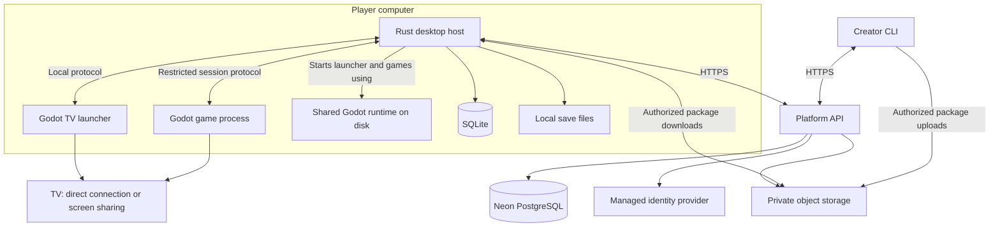

# Couch Games: Technical Architecture and Build Plan

Status: target architecture, based on [PRODUCT.md](PRODUCT.md). See [IMPLEMENTATION_PLAN.md](IMPLEMENTATION_PLAN.md) for the execution checklist and [README.md](README.md) for what is currently implemented.

Updated: September 15, 2026.

## 1. Architecture decisions

The platform has two environments: software running on the player's computer and online services operated by us.

Confirmed product decisions:

- Games run on the player's own PC or Mac, using its CPU and GPU.
- The computer displays the game on a TV through a direct connection, such as HDMI, or compatible screen sharing.
- Players install the platform app. It installs and manages the Godot runtime for them.
- V1 games share one tested Godot runtime installation. Future incompatible runtimes are downloaded once per required version.
- Games are ordinary Godot projects, initially using GDScript and our SDK.
- SQLite stores local platform data on player computers.
- PostgreSQL on Neon stores global platform data for our backend.
- Installed games and local saves work offline.
- V1 proves creation, couch play, and private sharing; public discovery and commerce follow later.

The specific libraries and additional services below are recommendations. No infrastructure has been provisioned, and this document does not imply that these components have been implemented.

## 2. Recommended tech stack

| Component | Technology | Responsibility |
| --- | --- | --- |
| Games | Godot 4.x + typed GDScript | Gameplay, rendering, physics, audio, and scenes |
| Platform SDK | GDScript addon, autoload, reusable scenes | Controllers, player assignment, menus, lifecycle, saves |
| TV launcher | Godot Control nodes + GDScript | Library, settings, player profiles, install progress, game launch UI |
| Desktop host | Rust + Tokio | Bootstrap, downloads, installation, runtime selection, process supervision, local services |
| Local database | SQLite through SQLx | Installed releases, profiles, settings, cached library metadata, download jobs |
| Creator CLI | Rust + clap | Project checks, packaging, local installation, publishing |
| Platform API | Rust + Axum + Tokio | Accounts integration, libraries, sharing, release management, authorization |
| Global database | Neon PostgreSQL through SQLx | Platform records and relationships |
| Asset storage | Cloudflare R2, proposed | Private game packages, runtime artifacts, cover art, screenshots |
| Authentication | Managed OpenID Connect provider, selection pending | Hosted sign-in and account identity |
| API contracts | HTTP/JSON + OpenAPI | Versioned API used by the desktop host and CLI |
| Local protocol | Versioned JSON messages | Communication between Godot processes and the desktop host |
| Package specification | JSON Schema + PCK + SHA-256 + signed release metadata | Compatibility, content integrity, distribution identity |
| Backend deployment | Docker container on a managed container host | One API deployment initially; hosting provider pending |
| Build automation | GitHub Actions | Rust checks, Godot checks, native builds, packaging |
| Diagnostics | Rust tracing + rotating local logs | Actionable errors and opt-in diagnostic exports |

Use a Rust workspace to share manifest parsing, API models, package verification, and installation logic. Keep the SDK and launcher in GDScript so creators can inspect and modify normal Godot code.

Axum fits the Tokio ecosystem, and SQLx provides PostgreSQL and SQLite drivers. Keep separate database schemas and migrations for the two databases; sharing a library does not make their SQL interchangeable. [Axum documentation](https://docs.rs/axum/latest/axum/), [SQLx documentation](https://docs.rs/sqlx/latest/sqlx/)

Pin exact dependency versions in lockfiles and record the engine build during the initial prototype. This document deliberately does not treat a floating `latest` version as a production runtime.

## 3. System layout



The runtime is a shared executable on disk. The launcher and each game run in separate processes. A game crash must not take down the library or corrupt its database.

The desktop host is a per-user application process, not a privileged system service. It owns database writes, credentials, installation paths, and child-process lifecycle.

## 4. Shared Godot runtime

### Installation and bootstrap

Ship an installer containing the Rust host, launcher content, and the V1 runtime, or have the installer download the runtime before first launch. Prefer bundling for the first release so the initial download produces a usable app without a second setup step.

The host starts both the launcher and compatible games using that installed engine. Players do not install the Godot editor, Rust, or a database server.

Conceptual local layout:

```text
CouchGames/
  runtimes/1/<os>-<architecture>/
  launcher/<release-id>/launcher.pck
  games/<game-id>/<release-id>/game.pck
  manifests/<release-id>.json
  data/library.sqlite
  saves/<profile-id>/<game-id>/
  downloads/
  logs/
```

Use the operating system's application and user-data directories in implementation. On macOS, keep signed application bundles intact and store writable data outside them.

### Runtime contract

Runtime `1` identifies an exact Godot build, renderer policy, export configuration, and supported OS/CPU variants. Start with the Compatibility renderer as the V1 target, then validate actual performance on the intended hardware. Add another renderer only with a tested compatibility profile.

Use a release runtime capable of accepting an external PCK. Godot documents `--main-pack`, but export templates must be compiled with `disable_path_overrides=false` for that option. Verify the chosen binary rather than assuming any export template can act as the shared runner. [Godot command-line documentation](https://docs.godotengine.org/en/stable/tutorials/editor/command_line_tutorial.html)

Prove that the runtime launches two independent exported projects on Windows and macOS before building a distribution system around it. Verify imported resources and rendering on each target; a PCK should not be assumed universally portable without those checks.

Runtime updates are immutable releases. Install a candidate beside the existing build, test compatibility, and switch deliberately. Retain the previous build for rollback. Reclaim a runtime only when no installed launcher or game needs it.

Security fixes still require an update policy: an old runtime cannot be considered safe indefinitely just because games depend on it. Revalidate compatible games against a patched runtime and explicitly handle unsupported releases.

## 5. SDK and couch experience

### SDK structure

Provide `addons/couchgames/`, a `Platform` autoload, reusable UI scenes, and a starter project. The same SDK powers the launcher where applicable.

| Module | Responsibilities |
| --- | --- |
| Input | Per-player actions, analog values, dead zones, remapping, rumble, glyph lookup |
| Players | Join/leave, controller ownership, reconnect flow, local profile selection |
| UI | Focus navigation, button prompts, safe margins, pause/settings/join screens |
| Lifecycle | Ready, pause/resume, quit request, host disconnect, save completion |
| Saves | Versioned data, local persistence, errors, migration hooks |

Godot already supplies controller input and uses SDL 3 on desktop starting with 4.5. Build player ownership and console behavior on top of that foundation. Do not promise identical haptics or reliable controller-brand identification for every device. [Godot controller documentation](https://docs.godotengine.org/en/stable/tutorials/inputs/controllers_gamepads_joysticks.html)

Device IDs belong to the current process/session. Do not persist them as player identities or assume they survive reconnects. When two identical controllers are ambiguous, ask the player to press a button to reclaim their slot.

Global Godot input actions can combine devices. The SDK must filter input by assigned device and maintain per-player action state so Player 2 cannot accidentally control Player 1.

Proposed API shape:

```gdscript
Platform.input.action(player_id, "jump")
Platform.input.axis(player_id, "move")
Platform.input.glyph(player_id, "jump")

# Saves complete asynchronously and return an explicit result.
var result = await Platform.save("campaign", data)
Platform.quit_to_platform()
```

Freeze public API names after the sample game validates them. Document accepted data types and error behavior. Keep saves to bounded JSON-compatible data in V1; avoid deserializing arbitrary objects.

### TV and controller behavior

- Start with one to four local players.
- Provide complete controller navigation, including error dialogs and install failures.
- Pause launcher input while a game is active so both processes do not respond to the same button press.
- Restore focus and the selected library item when a game exits.
- Test ordinary rumble, Bluetooth/USB reconnects, sleep/wake, TV resolution changes, and audio routing.
- Connect controllers to the computer for the V1 baseline. Controller forwarding through a TV or streaming receiver depends on the external solution.
- Support existing screen-sharing arrangements without building a streaming protocol. Publish tested setups and their limitations; do not promise every mirroring system will have acceptable latency.

## 6. Local data and saves

SQLite is the local source of truth for installed content. Neon is the source of truth for online ownership and sharing permissions. A cached library is not permission to obtain new private content.

Suggested local tables:

| Table | Purpose |
| --- | --- |
| `local_profiles` | Couch profiles, including profiles without online accounts |
| `installed_releases` | Game/release IDs, paths, integrity state, active version |
| `installed_runtimes` | Available runtime builds and compatibility IDs |
| `download_jobs` | Pending, downloading, verifying, installed, failed |
| `library_cache` | Last synchronized online library metadata |
| `controller_preferences` | Saved mappings and dead zones with reconnect-safe identifiers |
| `settings` | Display, audio, accessibility, and platform preferences |

Only the host opens the library database. Games receive a restricted save interface for their current game and profile, not a SQLite connection.

Store save payloads as versioned files, separate from library metadata. Write to a temporary file, flush, then replace atomically where supported, preserving a recoverable prior version. Game updates and uninstalls should preserve saves by default.

Use separate migrations for local SQLite and server PostgreSQL. Back up local data before destructive migrations and define compatibility with app rollback.

Persist login secrets in the operating system credential store. Keep them out of game packages, save files, logs, and ordinary SQLite fields.

Offline policy for V1: already installed games remain playable after account logout or network loss. Revoking a share prevents future downloads and updates once checked online; it cannot recall copies already downloaded to another computer. Make this behavior explicit in sharing UI.

## 7. Platform backend

### API and Neon

Start with one modular Rust API service. It handles profiles, libraries, membership, invitations, releases, upload authorization, and download authorization.

Neon credentials exist only in server configuration. The desktop host and CLI call authenticated HTTPS endpoints; ordinary games do not receive account-wide API credentials.

Use bounded SQLx connection pools and TLS. Neon offers pooled endpoints; choose pool limits and test driver behavior under deployment load. Run migrations through a controlled deployment step, using a direct connection when required by migration/session behavior. [Neon connection pooling](https://neon.com/docs/connect/connection-pooling?a=1a168c42-80d8-4b33-8fd7-6426a6895fae)

Suggested global tables:

- `users`: platform ID linked to identity-provider subject.
- `families`, `family_members`: shared-library groups and member roles.
- `games`: creator, title, description, player count, visibility.
- `releases`: immutable release identity, runtime requirement, SDK version, validation state.
- `release_artifacts`: OS/architecture/renderer variant, object key, byte count, SHA-256.
- `library_entries`: games saved to a user's library.
- `game_grants`: authorization to access a game for a user or family.
- `share_invites`: expiring, revocable invitation tokens stored as hashes.
- `runtime_releases`: approved runtime builds and artifact metadata.
- `validation_jobs`: queued checks, attempts, results, and processing lease.

Enforce creator ownership and membership in every relevant API operation. Use foreign keys, uniqueness constraints, and transactions for publishing and invite redemption. Do not equate a library entry with an access grant.

### Authentication

Use a managed identity provider with hosted sign-in and standards-based tokens. Select it before implementing account flows; require native-app support and a workable couch login flow.

For the creator CLI or desktop browser login, use authorization code flow with PKCE through the system browser. For TV login, prefer a device authorization flow that lets the player approve a code on their phone. Validate issuer, audience, expiry, and the returned identity on the backend. [Native-app OAuth](https://www.rfc-editor.org/info/rfc8252/), [device authorization](https://www.rfc-editor.org/info/rfc8628/)

Local couch profiles do not each require an email address or online identity. Keep guest play available.

### Assets and background work

Use private R2 buckets for package artifacts. The API verifies authorization before issuing a short-lived upload or download URL. R2 supports S3-compatible presigned URLs; treat these URLs as temporary bearer credentials and omit them from logs. [R2 presigned URLs](https://developers.cloudflare.com/r2/api/s3/presigned-urls/)

Separate uploaded, unvalidated objects from approved immutable release artifacts. Verify stored size and content hash on the server. Finalized releases must not remain writable through a creator's old upload URL.

Run package validation outside API requests. Begin with a PostgreSQL-backed job table and a worker with leases, timeouts, bounded retries, and idempotent finalization. Any job that executes a game runs in disposable isolation with no production database, signing, or storage credentials.

Use short polling for library updates in V1. Real-time subscriptions, distributed caches, and a separate message broker can wait until measurements justify them.

## 8. Local communication and game isolation

Use a small JSON request/event protocol with message IDs, protocol version, payload limits, explicit errors, and timeouts. A loopback transport is convenient for GDScript, but its availability inside the chosen OS sandbox must be proven in the first milestone. Use a native transport bridge if necessary.

The host creates separate launcher and game sessions. Each session has a short-lived capability secret delivered through a protected bootstrap mechanism; do not expose credentials in command-line arguments. Bind sessions to the launched process and restrict each game to its own save namespace and lifecycle operations.

The launcher may request installs and library changes. A game may report readiness, write its own saves, and request exit. Games cannot request arbitrary process execution, arbitrary paths, other games' saves, or platform credentials.

GDScript and PCK files are executable content. Neither signing, scanning, a restricted SDK, nor a separate process alone provides an OS security boundary. Godot exposes OS APIs, including process creation. [Godot OS API](https://docs.godotengine.org/en/stable/classes/class_os.html)

Evaluate Windows AppContainer and a signed macOS App Sandbox runtime/helper as platform-specific foundations. Their suitability for shared PCK loading, graphics, audio, controllers, and per-game isolation must be demonstrated; these are investigation targets, not a completed cross-platform sandbox. [Windows AppContainer](https://learn.microsoft.com/en-us/windows/win32/secauthz/appcontainer-isolation), [Apple App Sandbox](https://developer.apple.com/documentation/security/app-sandbox)

Required boundary for distributed games: read-only access to approved game/runtime content; bounded scratch storage; only the current game's save access; no platform credentials, arbitrary host filesystem access, or unauthorized network/process access. Account for Godot's writable `user://` needs.

Trusted, self-created games can exercise the local prototype. Distribution to other users requires a working isolation design and adversarial tests. If an OS cannot support the required boundary, narrow supported distribution targets or revisit the runtime before shipping that feature.

## 9. Packaging, publishing, and updates

### Package specification

A release consists of a manifest, one or more tested PCK artifacts, and optional artwork. Runtime binaries are distributed separately and reused.

Illustrative manifest, with placeholder hash:

```json
{
  "manifest_version": 1,
  "game_id": "example.family-racing",
  "title": "Family Racing",
  "release_id": "release-001",
  "version": "0.1.0",
  "runtime": "1",
  "sdk": "0.1.0",
  "players": { "min": 1, "max": 4 },
  "artifacts": [
    {
      "os": "windows",
      "architecture": "x86_64",
      "renderer": "gl_compatibility",
      "file": "game.pck",
      "size_bytes": 123456,
      "sha256": "<64-character-content-hash>"
    }
  ]
}
```

Validate manifests against a versioned JSON Schema. The provisional implementation requires byte sizes; add tested platform minimums before runtime distribution. Publish additional variants for supported Mac and Windows targets; reuse identical bytes only after cross-target testing confirms compatibility. The local implementation's schema and semantic validator are in `schemas/` and `crates/manifests/`.

Sign exact release metadata that binds game identity, release identity, runtime requirement, and artifact hashes. Include signing-key IDs and a rotation mechanism. Use an established signing library and documented serialization, not custom cryptography. A signature proves provenance and integrity, not harmless behavior.

### Creator flow

Proposed CLI commands, to be implemented:

```text
couch init
couch doctor
couch validate
couch pack
couch install ./dist/release.json
couch login
couch publish --visibility private
```

`pack` invokes the pinned Godot tooling on the creator's machine. Provide human-readable errors and `--json` output with stable error codes for AI agents. Keep the original project editable and exportable outside the platform.

Publishing creates a draft release, authorizes upload, validates the stored artifacts, signs approved metadata, then atomically marks the release available. Repeated requests must not create duplicate releases or partially published libraries.

### Player flow

1. Redeem an invite and add the authorized game to the library.
2. Resolve a compatible release and verify required disk space.
3. Reuse the installed runtime, or install its required version once.
4. Download into staging, resume safely against the same immutable object, and verify size/hash/signature.
5. Atomically activate the release and commit installation state.
6. Launch through the host, establish the game session, and wait for readiness.
7. Restore the launcher on normal exit, timeout, or crash.

Keep the previous release until the update is verified. Never modify a running game's files. Interrupted installs must leave the previously installed game playable. Reject unexpected paths, oversized packages, and unsupported manifests before activation.

App updates also require signed metadata and recovery if interrupted. Reuse a maintained update framework where it fits, or ship signed installer updates initially; choose that mechanism during the native packaging milestone.

## 10. Repository and development workflow

Proposed monorepo:

```text
PRODUCT.md
TECH_STACK.md
Cargo.toml
apps/
  launcher/                 # Godot project
  desktop-host/             # Rust bootstrap and local services
  cli/                      # Rust creator tools
  api/                      # Rust platform API
  worker/                   # Validation coordinator
sdk/
  addons/couchgames/
crates/
  protocol/
  manifests/
  installer/
  api-client/
schemas/
  manifest.schema.json
migrations/
  postgres/
  sqlite/
examples/
  four-player-demo/
tests/
  fixtures/
  integration/
docs/
  sdk/
  runtime/
  controller-test-matrix.md
  security-boundaries.md
```

Develop local play without cloud services. Use local PostgreSQL for API development or an isolated Neon development database, plus a separate development asset bucket. Keep production credentials out of local fixtures and untrusted validation workers.

CI should run formatting, linting, Rust tests, manifest checks, headless SDK tests, and sample-project exports. Use native Windows and macOS build jobs for installers. Sign Windows distribution artifacts and sign/notarize macOS applications before external testing.

Headless tests can prove action routing and state transitions, but cannot prove real Bluetooth reconnection, physical rumble, readable TV UI, or window focus. Maintain a small hardware matrix and manual release checks for those behaviors.

## 11. Build milestones and acceptance criteria

### Milestone 0: runtime and OS feasibility

Build two tiny games and a launcher, run them through one installed Godot runtime, and prototype the Rust host.

Acceptance:

- Windows and macOS launch both packages without an editor installed.
- The launcher and games reuse the same runtime installation per target.
- A crashed game returns control to the launcher.
- The proposed sandbox can support graphics, audio, controllers, package loading, and the local protocol while enforcing its access boundary.

Record exact engine/build settings and OS targets here. Resolve feasibility failures before committing to the distribution format.

### Milestone 1: SDK and sample game

Build player joining, actions, glyph fallback, remapping, disconnect recovery, pause, TV menus, saves, and quit-to-platform.

Acceptance: four players can complete a session with controller-only navigation; disconnecting one device does not transfer control to another player; restarting the game restores its save. Verify direct TV output and at least one compatible screen-sharing setup.

### Milestone 2: local platform app

Build the library UI, SQLite storage, local package installation, runtime management, and update recovery.

Acceptance: a fresh computer installs the platform, imports two games, plays offline, survives an interrupted update, and retains saves after an update or game uninstall.

### Milestone 3: private distribution

Build authentication, the Neon schema/API, private object storage, publishing, validation jobs, invitations, and authorized downloads.

Acceptance: one creator publishes a game and another account installs it on a second computer. Unauthorized accounts cannot obtain the package. Retried publishing is safe. Revocation blocks future authorized downloads. Isolation tests pass on every supported recipient OS.

### Milestone 4: V1 release readiness

Finish signed installers, runtime/app update strategy, diagnostics, backup/restore checks, SDK documentation, and hardware validation.

Acceptance: an unfamiliar creator can follow the starter documentation to build, validate, publish, and share a playable game; a recipient can install and play from the couch without managing Godot or a database.

## 12. Decisions to resolve during implementation

| Decision | Required by |
| --- | --- |
| Exact Godot build, renderer settings, minimum OS versions, and CPU targets | Milestone 0 |
| OS sandbox design, per-game storage isolation, and compatible local transport | Milestone 0 |
| Stable SDK API and save schema | Milestone 1 |
| Installer and app update framework | Milestone 2 |
| Identity provider with native and couch login support | Milestone 3 |
| API/worker host, R2 adoption, signing-key storage, backup policy | Milestone 3 |
| Supported screen-sharing and controller test matrix | Milestone 4 |

Defer payment processing, public discovery, cloud saves, online multiplayer services, game streaming infrastructure, other engines, and recommendation systems until the create-play-share loop works.

The first deliverable should be two small games sharing one installed runtime, launched from the controller-driven library, with reliable return-to-platform and local saves. Every later service should support that working experience.
