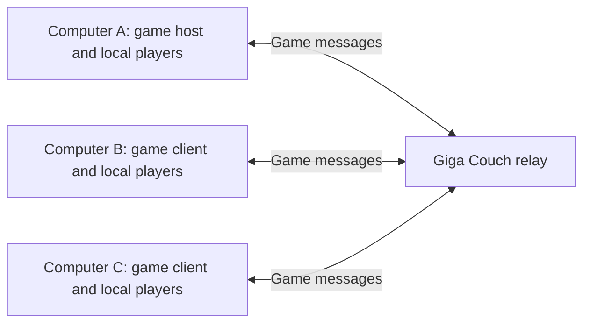

# Multiplayer: LAN and managed online relaying

Status: design direction, September 15, 2026. Multiplayer networking is not implemented or verified. Transport choices and commercial terms below are proposals. The existing V1 sequence remains unchanged; this document defines the multiplayer workstream when scheduled.

Commercial follow-up, September 16, 2026: [pricing strategy options](pricing-strategy.md) explores a paid play-and-create platform, universal membership, and an optional marketplace. The developer subscription below remains one option; the payer and price are not selected. These alternatives do not change the relay architecture.

## 1. The product

Giga Couch should let people play the same game across multiple computers and screens, with one or several local players on each computer.

For online play, **Giga Couch operates a message relay. Game simulation stays on player-owned computers.** The relay manages connections and forwards game messages; it does not load game packages, run Godot, simulate physics, or render video.

A developer can use the Giga Couch SDK and managed relay service instead of deploying their own networking backend. A proposed monthly subscription includes connection capacity and relay traffic. Developers still implement their game's multiplayer rules, assisted by SDK templates.

Example: two people on the living-room PC join three people on another family's Mac. Each computer runs the game, receives input from its own controllers, and renders its own view of the shared world.

### Supported experiences

| Mode | Connection | Online service required? |
| --- | --- | --- |
| Same-screen couch play | Local input within one game process | No |
| LAN multiplayer | Direct connection between computers on the local network | No |
| Online multiplayer | Computers connect outward to a Giga Couch relay | Yes |

The initial network design targets private family/friends sessions. Preserve the existing 1–16 local-player capability. Start network testing with four total players across two computers; a proposed initial ceiling of 16 total session players must be tested separately from the number of connected computers.

Each computer reuses its own installed compatible runtime and runs the game in a separate process. Players need the compatible game installed. Streaming a host's video to guests is a separate feature.

## 2. How messages travel

### LAN

```text
Computer A: game host + local players
       ⇅ direct local-network messages
Computer B: game client + local players
```

### Online



The **game host** is a player's Godot process that decides the official world state. It is different from the **Rust desktop host**, which manages installation, credentials, local storage, and process lifecycle.

For example, Computer B sends a movement request through the relay to Computer A. A checks the request, simulates the movement, and sends a world update through the relay to B and C. A applies the result locally without sending it back through the relay to itself.

The relay understands delivery metadata such as room, sender, recipient, and message size. Game payloads are opaque to its application logic. It can reject an unauthorized sender or oversized packet without understanding what “jump” means. Opaque payloads are not automatically end-to-end encrypted; transport encryption and end-to-end encryption are separate decisions.

This model is established elsewhere: Nakama's relayed matches forward messages without validating gameplay. [Nakama relayed multiplayer](https://heroiclabs.com/docs/nakama/concepts/multiplayer/relayed/)

## 3. Responsibilities

| Component | Owns |
| --- | --- |
| Game | Simulation, movement, physics, scoring, spawning rules, cameras, world saves, and visibility of private information |
| SDK | Local-player routing, session roster, message interface, sequencing, lifecycle events, and reusable synchronization examples |
| Rust desktop host | Account credentials, authorized installs, launch configuration, and restricted game-session capabilities |
| Platform API | Online room authorization, invitations, compatible-release checks, relay assignment, and subscription entitlement |
| Relay | Authenticated connections, routing, room membership enforcement, quotas, bounded queues, and usage counters |
| Neon | Durable platform records and aggregated usage, accessed only by backend services |
| SQLite | Local library and platform settings on each computer |

Room membership and live connection routing can initially live in relay memory. Do not write every movement message to Neon. Relay restart should produce an explicit session failure; recovery and resumable sessions can follow later.

Many different games can share the same relay service. Isolate rooms and developer tenants by authorization and resource limits; never load a developer's executable game code into the relay.

## 4. Player and room identity

A computer connection is not a player. Each connection may own several local players.

Keep separate identifiers:

- `room_id`: one multiplayer session.
- `connection_id`: one currently connected computer, assigned by the service or LAN host.
- `local_slot`: the existing input slot on that computer.
- `session_player_id`: a player identifier unique within the room, assigned by the game host.
- Optional profile identity: separate from temporary slots and connections; couch guests need not each create an online account.

The session roster maps `session_player_id` to its owning connection and local slot. “Player 1” on two computers must create two distinct session players. Check every gameplay request against this ownership map.

Count local players, total session players, and computer connections independently. The relay/API owns connection membership; the game host owns the player roster within the room's enforced seat limits.

## 5. Joining and starting

### LAN flow

1. Choose **Play → Nearby → Host game**.
2. Advertise a small amount of room metadata on the local network.
3. Other computers choose the room, or enter its address when discovery is unavailable.
4. Check the game release and network protocol, add local players, and ready up.
5. Start after every participating computer has loaded the world.

Begin the engineering prototype with address entry, then add discovery. Test firewalls, OS network permissions, multiple interfaces, and guest-network isolation. Address entry cannot bypass a network that blocks device-to-device traffic. Installed LAN play should work without an account or Internet connection.

### Online flow

1. The creator's game is configured for the managed multiplayer service.
2. A player chooses **Play → Online → Create room** through the platform.
3. The backend verifies access and capacity, creates the room, and assigns a relay.
4. Other computers join through an invitation or room code. The backend authorizes admission and checks release compatibility.
5. Each computer receives a short-lived, room-scoped connection credential through the protected local bootstrap flow and connects outward to the relay.
6. The relay authenticates connections before permitting game messages. Players join the roster and ready up.
7. The game host supplies initial world state; clients acknowledge readiness before gameplay input is accepted.

Room codes are lookup conveniences. Bound guessing attempts, expire invitations, and enforce private-room access. Keep long-lived platform credentials out of games and logs.

Require the same immutable game release and a compatible networking protocol initially. Verify each OS-specific artifact using its own hash; Windows and macOS packages need not be byte-identical. Missing content goes through the normal authorized installation flow. A room invitation is not automatically permission to download a private game. Unsigned imports remain local developer content.

## 6. Transport plan

**Selected product model:** managed online message relaying. **Open implementation choice:** the transport used to carry those messages.

### LAN prototype: ENet

Use Godot's ENet support for a direct host/client connection. Godot supplies connection events and reliable/unreliable delivery options. [Godot high-level multiplayer](https://docs.godotengine.org/en/4.7/tutorials/networking/high_level_multiplayer.html)

### First online prototype: secure WebSocket relay

A concrete starting proposal is a Rust/Tokio relay with an Axum WebSocket endpoint and Godot's `WebSocketPeer`. Every computer opens an outbound `wss://` connection; the relay forwards a small, versioned application envelope. This tests room authorization and routing without an additional native Godot extension. Godot supports binary/text WebSocket messages, polling, and TLS certificate validation. [WebSocketPeer](https://docs.godotengine.org/en/stable/classes/class_websocketpeer.html)

This is a connectivity prototype, not a promise of action-game latency. WebSocket uses reliable ordered delivery; retransmission can delay newer movement behind older data. Define bounded outgoing queues, discard superseded snapshots before enqueueing, and disconnect clients that cannot keep up. Data already queued inside the transport cannot be recalled by an application-level “unreliable” flag.

Keep the SDK's session messages independent of the transport. If using Godot's scene-replication/RPC APIs, implement and test an appropriate peer adapter separately. A Rust WebSocket endpoint is not automatically compatible with `WebSocketMultiplayerPeer`, and the relay should not reimplement Godot's internal scene protocol.

### Action-game transport evaluation

Compare the prototype with WebRTC data channels through TURN or another maintained authenticated datagram relay before selecting the production action-game path. TURN forwards traffic and does not run the game. WebRTC requires signaling, and the native Godot implementation needs runtime/architecture validation. [TURN](https://webrtc.org/getting-started/turn-server), [WebRTC signaling](https://webrtc.org/getting-started/peer-connections), [Godot native WebRTC](https://github.com/godotengine/webrtc-native)

For the initial online service, deliberately test a relayed path. Direct peer connections can be an optional later optimization; they are not necessary to deliver the proposed product. Neither TURN nor WebRTC substitutes for our room authorization, usage accounting, or player roster. Preserve those semantics when evaluating another transport.

## 7. Gameplay messages and synchronization

Start with the game host as the authority. Other computers send inputs; the host validates and applies them, then distributes results.

| Message | Direction | Intended behavior |
| --- | --- | --- |
| Player join/leave and ready | Through the session coordinator/game host | Reliable, validated, idempotent where retried |
| Movement input | Owning computer → game host | Sequenced; stale input expires to neutral |
| Discrete action such as jump | Owning computer → game host | Acknowledged/retried or redundant, with deduplication |
| World snapshot | Game host → clients | Newer state supersedes older state |
| Round change or score event | Game host → clients | Reliable and deduplicated |
| Initial state | Game host → joining client | Bounded transfer completed before gameplay starts |

The relay stamps the sender from its authenticated connection. It must reject cross-room routing and role violations, such as a client sending a host-only message. The game host separately checks player ownership, values, action timing, speed, and game rules.

Use a bounded envelope containing a protocol version, destination, message class, sequence/event ID, and payload. Validate lengths before allocating; use explicit data schemas without executable object deserialization. Limit initial-state size and define chunking if required. Package downloads do not travel through the gameplay relay.

Clients interpolate remote movement between snapshots. Responsive online action games may also need local prediction and reconciliation: immediately show expected local movement, then correct against the host. A LAN demo alone does not establish acceptable online responsiveness. Do not rely on identical physics outcomes across machines by replaying inputs alone.

Cameras remain local presentation choices. Games may follow each computer's local group, use local split-screen, or show a common arena. Send private information only to authorized recipients.

### Changes needed in Little World

- Keep `player_input.gd` focused on device-isolated local input; add a separate session roster.
- Separate input collection, authoritative simulation, and presentation in `character.gd`.
- Translate camera-relative input into a bounded world-space movement request on its originating computer.
- Spawn/remove network characters in `world.gd` from the authoritative roster rather than only local controller signals.
- Ensure remote characters never consume local controllers.
- Keep local-only play usable through the same gameplay interfaces without requiring a network service.

Future manifest fields should declare supported modes, local/total player limits, and network protocol compatibility. Version that contract in `crates/manifests`; do not silently change the meaning of today's `players` field. Retain library/install behavior in `crates/local-library`.

## 8. Disconnects, saves, and operating boundaries

- **Controller disconnect:** remove that local player under the current SDK policy; other local players remain connected.
- **Computer disconnect:** neutralize input and remove its players after a bounded timeout. Rejoining initially creates fresh players after a state sync.
- **Game host exits:** end the session with a clear message. A relay does not take over simulation. Host migration is later work.
- **Relay fails:** report connection loss, stop applying stale input, and return to a recoverable UI. Do not silently create divergent worlds.
- **Local pause/focus loss:** neutralize local input; a menu does not automatically pause everyone else's game.
- **Saves:** initially the game host owns the shared-world save on its computer. Make that ownership visible; cloud saves are separate work.

Validate the OS sandbox's network path before distributing this capability: either scoped game network access or a platform networking helper with a bounded local interface. Keep games separate from launcher and privileged operations. An SDK wrapper alone does not enforce isolation.

Use authenticated encrypted online connections with certificate verification. Enforce per-connection, room, and developer limits for payload size, message rate, queue memory, and connection count. The relay enforces service rules; the game host enforces gameplay rules. A dishonest host can still cheat.

## 9. Monthly developer service

Proposed offering: **Giga Couch Online — rooms, invitations, message delivery, SDK integration, diagnostics, and usage visibility.** Developers pay for managed connectivity; players run the game.

| Proposed plan | Included capability |
| --- | --- |
| Development | Local/LAN play and a bounded online test allowance |
| Creator | Monthly connection capacity and relay traffic for private games |
| Higher usage | Larger included limits or explicitly enabled usage-based overages |

Do not publish prices until measuring representative games. Track at least:

- Concurrent computer connections, separately from player seats.
- Relay egress bytes, including each recipient of a forwarded message.
- Connection duration, message rate, and relay CPU/memory.
- Shared backend, observability, support, and idle-capacity costs.

Illustrative arithmetic only: forwarding a 1 KB update to three recipient computers 20 times per second produces about 60 KB/s, or 216 MB/hour, of outbound payload before protocol overhead and other messages. Sending to more players on the same computer need not create more network copies.

Provide usage alerts, configurable budgets, and explicit overage settings. Define whether reaching a limit blocks new sessions or also ends existing ones; budget policy must be visible before use. Reject an unlimited flat-fee promise until economics support it. No billing integration or production capacity is selected by this design.

## 10. Implementation sequence and acceptance

### A. Session model and LAN proof

- [x] Haymaker prototype: versioned host/client snapshots, peer-owned input, eight-computer cap, host authority, address join. Loopback ENet handshake is covered by SDK checks; two-household LAN play is still a physical acceptance.
- [ ] Run Little World on two computers with two local players each and independent camera views.
- [ ] Verify spawn, movement, jump, respawn, leave, neutral input on timeout, and host exit.
- [ ] Reject build mismatches and attempts to control someone else's player.
- [ ] Play with Internet access disconnected; then add discovery and controller-driven room UI.

### B. Relay proof

- [ ] Implement one relay instance and a bounded room lifecycle: create, join, ready, playing, ended.
- [ ] Add scoped credentials, authenticated sender identity, role/routing checks, and quotas.
- [ ] Connect two real residential networks through the relay without router configuration.
- [ ] Verify incompatible releases, denied access, late-join state, slow clients, and relay failure.
- [ ] Measure bandwidth and queued data, including fan-out to multiple recipients.

### C. Gameplay and transport qualification

- [ ] Test representative latency, jitter, loss, and disconnects; example conditions are 50/100/200 ms round-trip latency and 1–5% packet loss, not acceptable-performance promises.
- [ ] Compare WebSocket and a maintained datagram/WebRTC relay path for Little World.
- [ ] Add and test prediction/reconciliation if the gameplay needs it.
- [ ] Validate Windows/macOS interoperability, actual controllers, and sandbox networking separately.
- [ ] Test limits across computer counts and players per computer before advertising capacity.

### D. Creator service

- [ ] Extract stable SDK APIs and documented movement/turn-based templates.
- [ ] Integrate authorized release resolution, room UI, opt-in diagnostics, and usage reporting.
- [ ] Load-test cross-room isolation, connection churn, quotas, and operational recovery.
- [ ] Measure service economics and define paid allowances and budget behavior.

Use synthetic fixtures for engine-independent protocol tests and label them non-playable. Follow the repository's Rust and SDK verification requirements when implementation begins. Loopback tests, package integrity, real LAN sessions, physical controllers, Internet behavior, and sandbox enforcement establish different things and must be reported separately.

The first deliverable is **four players across two computers in Little World**. The online deliverable is that same shared world reached through a relay that never executes the game.

## Background

The earlier [multiplayer research](network-multiplayer-research.md) compares alternative architectures. This document records the subsequent relay-service direction and takes precedence over that note's earlier transport recommendation. Dedicated cloud simulation, custom video streaming, public matchmaking, and host migration are outside this initial multiplayer scope.
