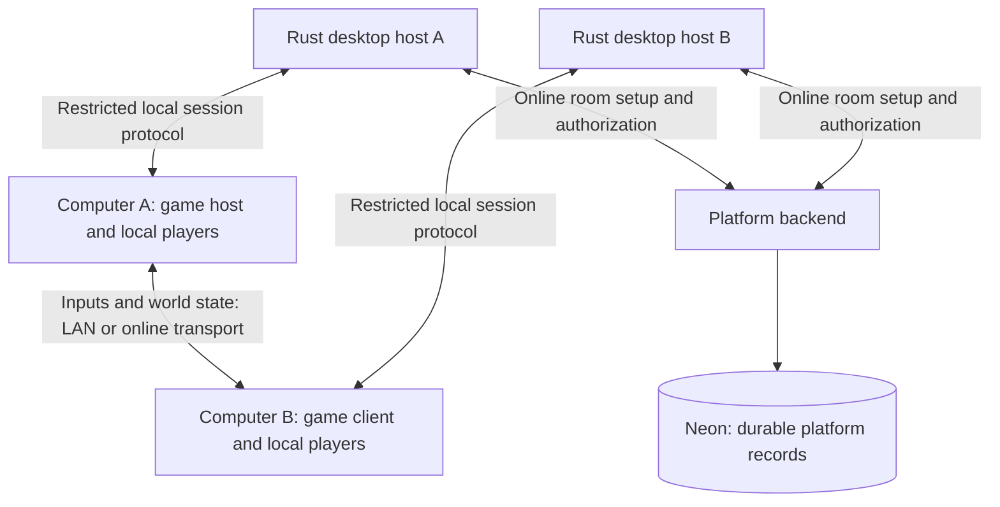

# LAN and online multiplayer research

Date: September 15, 2026. Status: proposal for discussion, not implemented or runtime-verified. This note does not change the V1 commitments in PRODUCT.md or IMPLEMENTATION_PLAN.md.

Follow-up: [Multiplayer: LAN and managed online relaying](multiplayer.md) records the selected relay-service direction and the proposed implementation sequence. Use that document for the current design; this note preserves the earlier alternatives research.

## Recommendation

Build one session model supporting multiple computers and multiple local players per computer. Prove it with Little World over LAN, then add private online rooms with a relay fallback. Keep game simulation on a participating player's computer for the initial family/friends experience.

Working assumption: mixed couch and network play is the useful general case. One player per computer is a subset. Initially target 16 total participants per session, preserving support for up to 16 local players when the game allows it. This is a proposed limit, not a measured networking capacity or a commitment to 16 computers.

Example: two players on the living-room PC, one on a laptop, and three on a remote family's Mac share one six-player world. Each computer runs the game and renders its own view. Controllers remain connected to their local computer.

## 1. Three experiences to distinguish

| Experience | Execution and display | Fit |
| --- | --- | --- |
| Same-screen couch play | One game process, several controllers | Existing foundation |
| LAN or online network play | A game process on every computer; inputs and world state cross the network | Recommended direction for independent views |
| Remote couch streaming | One computer runs the game; guests receive video and send controller input | Useful separate route for existing same-screen games |

Streaming can preserve an existing local game's logic, but ordinarily shares the host's view. Independent views would require additional rendering/streaming work. Steam Remote Play Together is an example of the remote couch model, not an integration already available to CouchGames. [Steam Remote Play documentation](https://partner.steamgames.com/doc/features/remoteplay)

For network play, camera design is a game choice: one view following that computer's local group, local split-screen, or a common arena view rendered independently everywhere. Private information, such as a card hand, must only be sent to authorized recipients; hiding it in the camera is insufficient.

## 2. Responsibilities



The **game host** is the participating Godot process that decides game state. It is distinct from the **Rust desktop host**, which manages local platform services.

Proposed ownership:

- **Platform:** rooms, invitations, local guest seats, compatible-release checks, connection setup, diagnostics, and join/leave UI.
- **Game:** movement, physics, scoring, world state, camera behavior, pause rules, and which information each participant may see.
- **Transport:** delivery between computers, directly or through a relay.

Keep moment-to-moment simulation out of Neon and the account API. SQLite remains local library storage. LAN rooms should work with the Internet disconnected and require no platform account. Online rooms use the backend for authorization and connection setup; long-lived account credentials stay in the desktop host.

An SDK can provide reusable networking patterns, but cannot automatically make arbitrary existing game logic network-correct.

## 3. LAN: first prototype

Use Godot's `ENetMultiplayerPeer` with one participating computer hosting. Godot supports connecting to a host's LAN address; its high-level API provides RPCs and connection events. Its sample lobby assumes one player record per peer, so we must adapt that model for couch groups. [Godot high-level multiplayer](https://docs.godotengine.org/en/4.7/tutorials/networking/high_level_multiplayer.html)

Suggested flow:

1. Select **Play → Nearby → Host game**.
2. Other computers see **Ryan's Little World — 3/16 players**.
3. Each joining computer adds its local players and readies up.
4. The host starts once releases match and every computer has loaded.

For the first engineering experiment, use a manually entered address and port. Then add bounded UDP discovery announcements; Godot exposes broadcast and multicast primitives. Discovery is separate from the game connection. Provide address entry as a fallback when discovery fails. [PacketPeerUDP documentation](https://docs.godotengine.org/en/stable/classes/class_packetpeerudp.html)

Test OS network permissions, firewalls, multiple interfaces, guest Wi-Fi isolation, and stale advertisements. Address entry can bypass failed discovery, but cannot bypass a network that blocks communication between devices. Announcements should contain only minimal room metadata and must not authorize package downloads or code execution.

## 4. Online: connectivity choices

Room codes identify a room; they do not solve router reachability. A consumer online experience needs a tested way through home-network restrictions, including a relay when a direct connection fails.

| Approach | Benefit | Cost or constraint | Assessment |
| --- | --- | --- | --- |
| Direct ENet with a reachable host port | Reuses the simplest LAN path | Router configuration and unreachable hosts complicate joining | Developer experiment, not the default consumer flow |
| WebRTC data channels with STUN/TURN | Standard connection negotiation and relay fallback | Signaling service, relay operations, native integration | Leading candidate for an online spike |
| Nakama relayed matches | Existing room/match and messaging infrastructure | Additional backend and Godot adapter; evaluate transport behavior for action games | Alternative if broader multiplayer services justify it |
| Dedicated game server | Game continues without a player's computer hosting | Runs game code on our infrastructure; per-game compute and isolation | Later option; requires expanding today's player-owned execution model |

With WebRTC, signaling exchanges connection details; STUN helps discover possible routes; TURN forwards traffic when needed. These services do not simulate the game. WebRTC requires a separate signaling channel, which could be part of our authenticated backend. [WebRTC connection setup](https://webrtc.org/getting-started/peer-connections), [TURN guidance](https://webrtc.org/getting-started/turn-server)

Native Godot WebRTC has an official extension implementation. Treat its inclusion as a platform-runtime decision: verify the selected engine, each target architecture, signing, and sandbox behavior, and avoid making every creator bundle an arbitrary native dependency. The extension has not been installed or tested for this investigation. [Godot native WebRTC repository](https://github.com/godotengine/webrtc-native)

Nakama provides a Godot 4 client and both relayed and authoritative matches. Relaying forwards game messages; it does not validate game rules. Its authoritative model requires custom server logic, not automatic execution of our existing GDScript games. A Godot high-level multiplayer adapter must be evaluated against the actual SDK/runtime; older Fish Game examples are not proof of current compatibility. [Godot client](https://heroiclabs.com/docs/nakama/client-libraries/godot/), [relayed matches](https://heroiclabs.com/docs/nakama/concepts/multiplayer/relayed/), [authoritative matches](https://heroiclabs.com/docs/nakama/concepts/multiplayer/authoritative/)

Steam Datagram Relay is another mature transport, but access outside Steam has eligibility and integration conditions, including shipping a version of the game on Steam. Its open-source networking library does not itself provide access to Valve's relay network. It should not be assumed available to every privately created CouchGames title. [Valve's requirements](https://partner.steamgames.com/doc/features/multiplayer/steamdatagramrelay)

Recommendation: prove WebRTC direct and forced-relay connections before selecting it. Preserve a small transport boundary so LAN ENet and online networking can share gameplay logic. Changing transports still needs tests for ordering, reliability, message limits, and connection lifecycle; it is not automatically a drop-in swap.

## 5. Shared simulation

Start with a host-authoritative model:

1. Each computer samples actions for its local players.
2. It sends sequenced input commands to the game host.
3. The host verifies ownership and bounds, then simulates everyone.
4. It sends world snapshots and gameplay events to the clients.
5. Clients render the world, smoothing remote movement between snapshots.

For an online action game, add local prediction and reconciliation: show the local player's expected movement immediately, then correct it against the host's result. Start without this for the LAN proof, but do not treat LAN responsiveness as evidence of acceptable Internet play.

Use replaceable updates for continuous movement and state, and reliably delivered, deduplicated messages for discrete events that must not disappear. A lost jump edge should not silently remove a jump; stale movement should time out to neutral. Define sequence numbers, acknowledgements where needed, and maximum input age.

Godot's `MultiplayerSpawner` and `MultiplayerSynchronizer` can help replicate entities and selected properties. They do not decide our game's authority rules or provide a complete movement prediction system. [Spawner](https://docs.godotengine.org/en/stable/classes/class_multiplayerspawner.html), [Synchronizer](https://docs.godotengine.org/en/stable/classes/class_multiplayersynchronizer.html)

Use different templates for different genres: turn-based games can exchange validated actions and resulting state; a platformer needs responsive motion; fighting games may justify a separate rollback design. Do not assume general Godot physics will produce identical results on every computer merely by replaying the same inputs.

For the first private-room version, the host leaving ends the session cleanly. Host migration needs ownership transfer, recoverable state, and reconnect coordination and should be a later feature. A relay does not keep the simulation alive after the host exits or make that host cheat-proof.

## 6. Changes implied by the current code

### Player identity

`player_input.gd` currently assigns local IDs 1–16. Keep those as local input slots and add a session roster:

```text
session_player_id -> owning_connection + local_slot + optional_profile
```

The host assigns session IDs. Local slot 1 on two different computers must produce two distinct session players. Never trust a message's claimed player ID without checking its sending connection. Track limits for total players, local players per computer, and computer connections separately.

Controller unplugging removes one local player under today's behavior. Network loss affects every player on that computer. Define these as distinct events. A later reconnect grace period needs a session-bound reconnect credential and fresh connection mapping, not reuse of a Godot device or peer ID.

### Little World movement and cameras

`character.gd` currently reads local input and uses its camera basis inside `_physics_process`. Separate input collection, simulation, and visual presentation. Each computer can translate camera-relative input into a bounded world-space movement request, while the host remains responsible for speed, physics, jumping, and collision checks.

`world.gd` currently spawns from local input signals. In a network session it should spawn from the authoritative session roster. Remote characters must not consume local controller input. Each computer chooses its own camera target group.

### Package compatibility

Initially require the same game and immutable release plus compatible runtime/SDK networking versions before joining. Use platform-specific artifact hashes for integrity; Windows and macOS packages need not have identical bytes. Source-project experiments can use an explicit development build identifier.

Future manifest metadata should separately declare supported modes, local and session player limits, and network protocol compatibility. Design/version this in `crates/manifests`; do not silently reinterpret the existing `players` field. Joining a room does not itself grant access to download a private game. Obtain missing content through the authorized library/install flow, and keep unsigned imports classified as developer content.

### Isolation and lifecycle

The existing architecture calls for restricted game networking. Distributed multiplayer therefore requires a concrete decision between sandbox-approved direct game sockets and a platform-owned networking helper with a bounded interface. Scope connection capabilities to the session; keep platform account and database credentials outside game code. An SDK wrapper alone does not enforce OS restrictions.

A local menu or focus loss should neutralize that computer's input; it should not automatically freeze an online world. Initially save shared-world progress on the host through the existing planned per-game save interface, with explicit UI about who owns that world.

## 7. Proposed experiments and exit criteria

### A. Two-computer LAN proof

- Two independent source-game processes connect by address.
- Exercise two local players on each computer, distinct IDs, spawn/leave, movement, jumping, respawn, and independent camera views.
- Reject incompatible builds and attempts to control another computer's player.
- Handle lost connections and stale input without ghost movement.
- Run with Internet access disconnected.

Loopback processes are a useful first test but do not establish real LAN, cross-OS, or physical controller behavior.

### B. Couch-friendly nearby play

- Controller-driven host/join/ready UI, discovery with expiry, and useful connection errors.
- Late joins receive a complete current state before accepting gameplay input.
- Test sleep/wake, controller unplugging, Wi-Fi loss, room capacity, and host exit.
- Validate actual Windows/Mac combinations and local controller groups.

### C. Private online proof

- Authenticated room creation, invitations, short-lived scoped join credentials, and authorized release resolution.
- Connect computers on different residential networks.
- Force relay usage as well as test direct connections; verify failure behavior when a route is unavailable.
- Test, for example, 50/100/200 ms round-trip latency, jitter, and 1–5% packet loss. These are test conditions, not promised acceptable limits.
- Measure joining success, motion corrections, host upload, and relay bandwidth per session-hour before choosing production defaults.

### D. Reusable creator support

- Extract the validated session API and sample scenes into the SDK.
- Provide a host-authoritative movement example and a separate turn-based example.
- Publish AI-readable rules for ownership, input routing, spawning, cameras, and disconnects.

LAN has no required hosted gameplay service. Online adds signaling and relay operating costs; estimate those from measured traffic and current provider terms. Dedicated servers add game simulation compute. No cost or capacity benchmark has been run here.

## 8. Product questions still open

- Is mixed couch-plus-network play the first target, or mainly one player per screen?
- Should each computer follow its local group, use split-screen, or show a common arena?
- Are initial sessions private family/friends rooms only?
- Is ending the game when its host leaves acceptable initially?
- Should installed LAN play remain fully account-free? Recommendation: yes.
- Is 16 total session players the right initial ceiling? Keep this separate from eventual computer-count and performance limits.

Suggested first deliverable: **Little World on two computers, two players on each, one shared world, and a separate camera view per computer.** This tests the central product idea before committing to an online service or changing V1 scope.
